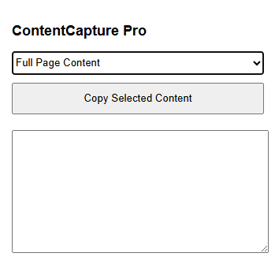

# ContentCapture Pro

_A powerful Chrome extension for efficiently extracting and copying content from any webpage._

---

## 📋 Description

**ContentCapture Pro** is a lightweight browser extension that allows you to quickly extract and copy different types of content from webpages. Whether you need the full page text, just the article content, all headers, or a list of links, ContentCapture Pro makes it easy with just a few clicks.

---

## ✨ Features

- **Multiple Content Extraction Options:**
  - Full page content
  - Article content (automatically detects main article sections)
  - Headers (H1, H2, H3)
  - Links
- **One-Click Copy**: Instantly copy extracted content to your clipboard
- **Preview Pane**: Review the extracted content before copying
- **Clean Interface**: Simple, intuitive user interface
- **Lightweight**: Minimal impact on browser performance

---

## 🔧 Installation

### From Chrome Web Store

_(Once published to the Chrome Web Store)_

1. Visit the ContentCapture Pro page on the Chrome Web Store
2. Click **"Add to Chrome"**
3. Confirm the installation when prompted

### Manual Installation (Developer Mode)

1. Download or clone this repository
2. Open Chrome and navigate to `chrome://extensions/`
3. Enable **"Developer mode"** (toggle in the top-right corner)
4. Click **"Load unpacked"**
5. Select the folder containing the extension files
6. The extension will appear in your browser toolbar

---

## 🚀 How to Use

1. Navigate to any webpage you want to extract content from
2. Click the **ContentCapture Pro** icon in your browser toolbar
3. Select the type of content you want to extract from the dropdown menu:
   - **Full Page Content**: All text from the page
   - **Article Content**: Main article text only
   - **Headers**: All H1, H2, and H3 headings
   - **Links**: List of all links on the page
4. Click **"Copy Selected Content"**
5. The content will be copied to your clipboard and displayed in the preview pane
6. Paste the content wherever you need it

---

## 🖼 Screenshots

---

## 💡 Use Cases

- Research and data collection
- Content curation and analysis
- Creating summaries of long articles
- Collecting references and sources
- Saving important information for offline use

---

## 🔐 Privacy

ContentCapture Pro operates entirely within your browser and does **not**:

- Collect or transmit any user data
- Access any content beyond the active tab
- Require any unnecessary permissions

---

## 📄 License

This project is licensed under the **Apache License 2.0** – see the [LICENSE](LICENSE) file for details.

---

## 🙋 Support

For issues, feature requests, or questions, please [open an issue](https://github.com/codwithabid/ContentCapture-Pro/issues) on our GitHub repository.
